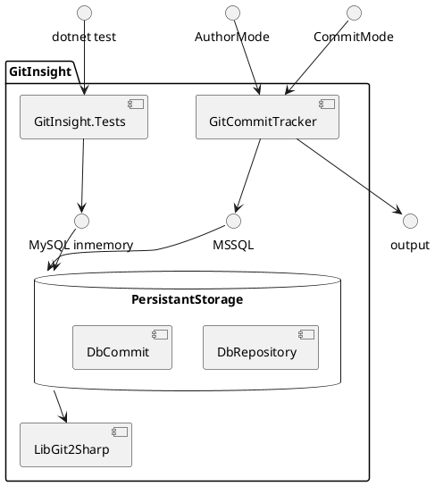

# Class Diagram showing structure of program

```plantuml
@startuml
() "CommitMode" as commit
() "AuthorMode" as author
() "dotnet test" as dotnettest

package "GitInsight" {
  [GitCommitTracker] as gitinsight
  [LibGit2Sharp] as lb2s

  [GitInsight.Tests] as test

  () "MSSQL" as mssql
  () "MySQL inmemory" as mysql


  database "PersistantStorage" as db {
    [DbRepository]
    [DbCommit]
  }
}

test --> mysql
mysql --> db

gitinsight --> mssql
mssql --> db


dotnettest --> test
commit --> gitinsight
author --> gitinsight

db --> lb2s

gitinsight --> () output
@enduml
```

