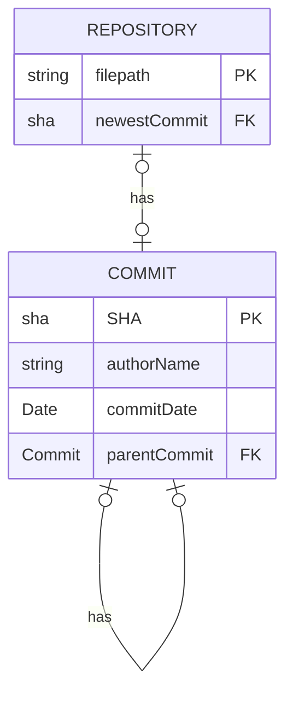

# EntityRelation diagram for the database implementation

```mermaid
erDiagram
    REPOSITORY |o--o| COMMIT:  has
    COMMIT |o--o| COMMIT: has
    REPOSITORY {
        string filepath PK
        sha newestCommit FK
    }
    COMMIT {
        sha SHA PK
        string authorName
        Date commitDate
        Commit parentCommit FK
    }
```
