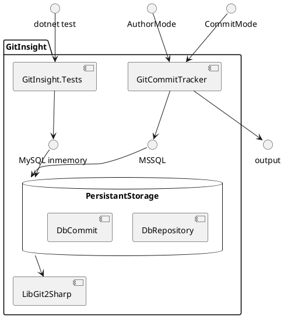
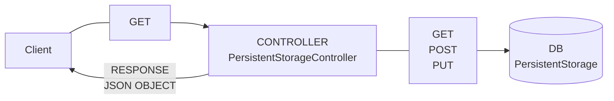
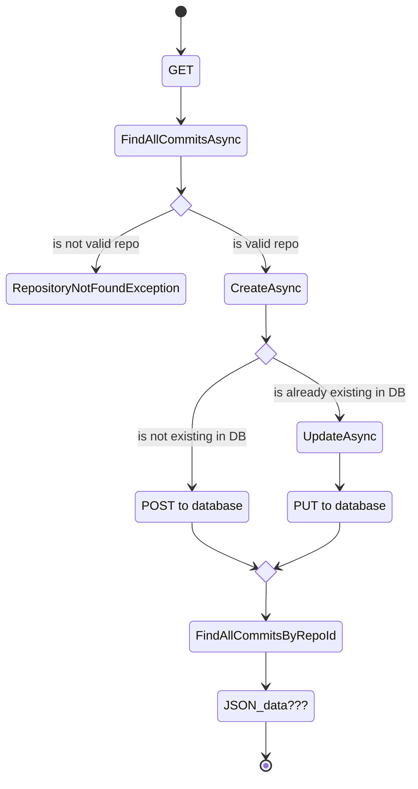
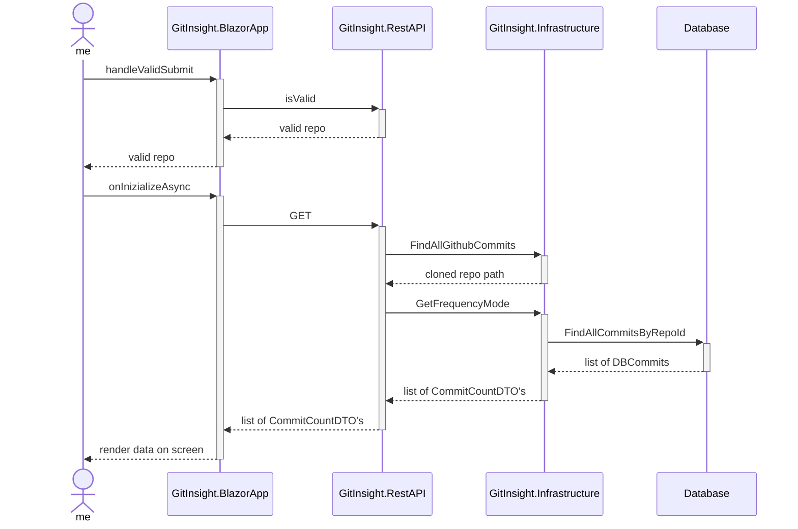

# Diagrams

## Class Diagram showing structure of program

## Architectural Diagram of REST Api

## Activity Diagram of GitInsight GET-operations 

NOT FINISHED!! Since JSON data not implemented yet

## Sequence diagram of GitInsight.BlazorApp running frequency mode

